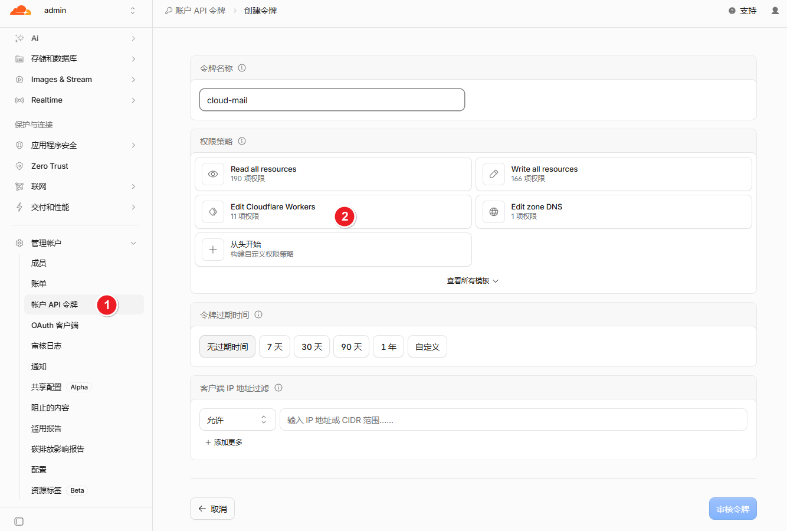
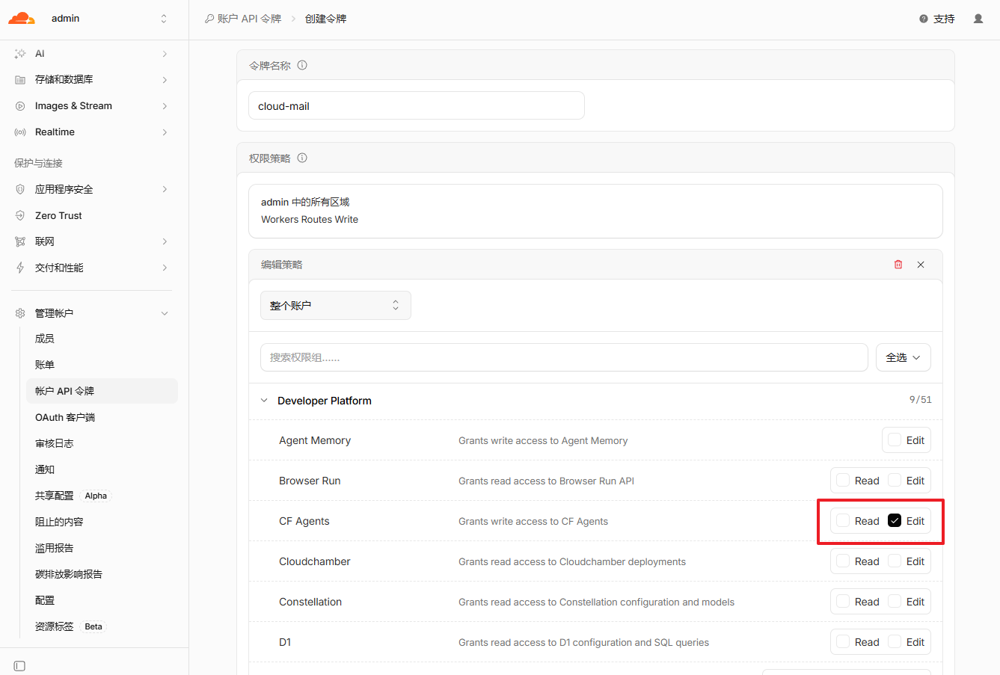
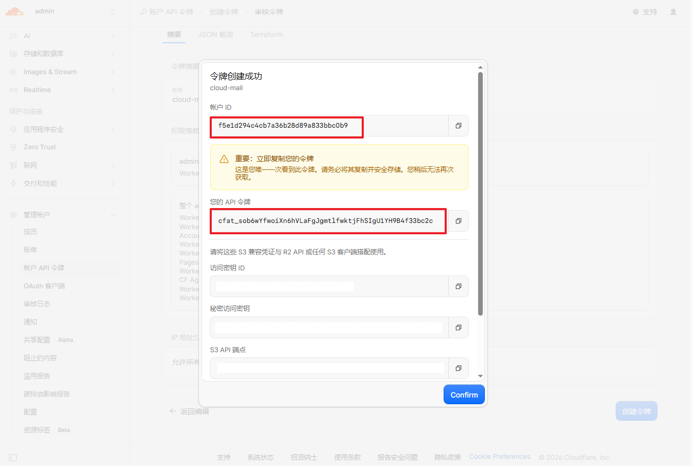

# GitHub Actions Deployment

## API Token Creation

1. create a token using a template.
   

2. Configure the required permissions.
   

3. Copy the generated API token.
   

## Environment Setup

1. Fork the repository: [https://github.com/maillab/cloud-mail](https://github.com/maillab/cloud-mail)
   

2. Configure GitHub Actions secrets.

| Secret Name           | Required | Description                                            |
|-----------------------|:--------:|--------------------------------------------------------|
| CLOUDFLARE_API_TOKEN  |    ✅     | Cloudflare API token                                   |
| CLOUDFLARE_ACCOUNT_ID |    ✅     | Cloudflare account ID                                  |
| CUSTOM_DOMAIN         |    ✅     | Worker custom domain, e.g., `skymail.ink`              |
| DOMAIN                |    ✅     | Email domains, e.g., `["example.com", "example2.com"]`      |
| ADMIN                 |    ✅     | Administrator email address, e.g., `admin@example.com` |
| JWT_SECRET            |    ✅     | JWT secret key (any random string, do not use special characters)                    |
| NAME                  |    ❌     | Worker project name  (optional)                                   |
| D1_DATABASE_ID        |    ❌     | D1 database ID (optional)                                       |
| KV_NAMESPACE_ID       |   ❌      | KV namespace ID (optional)                                        |

## Deployment

1. Run the GitHub Actions workflow.
   

2. Wait for the workflow to complete.
   

## Configure Email Forwarding

1. Refer to the Dashboard deployment steps: [Configure Email Forwarding](dashboard.html#configure-email-forwarding) 

2. Open the custom domain in a browser and create an admin account to log in.
   

