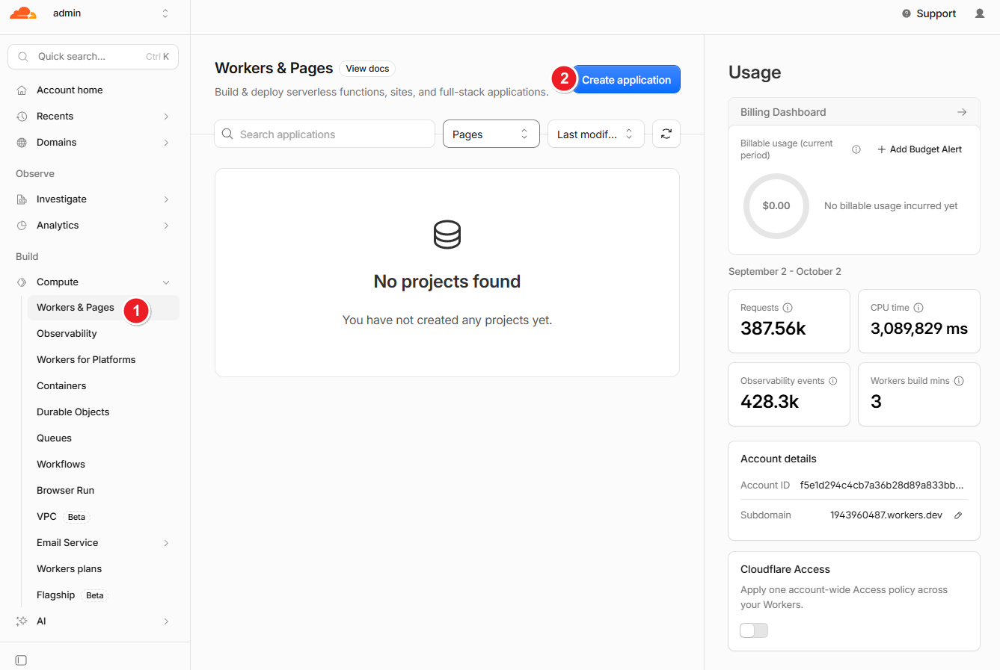
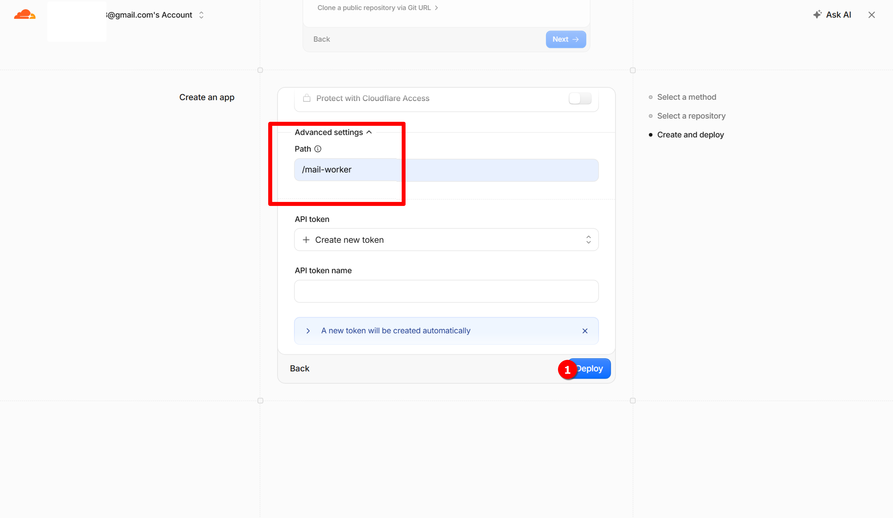
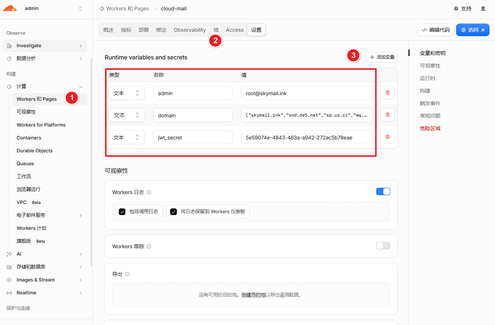
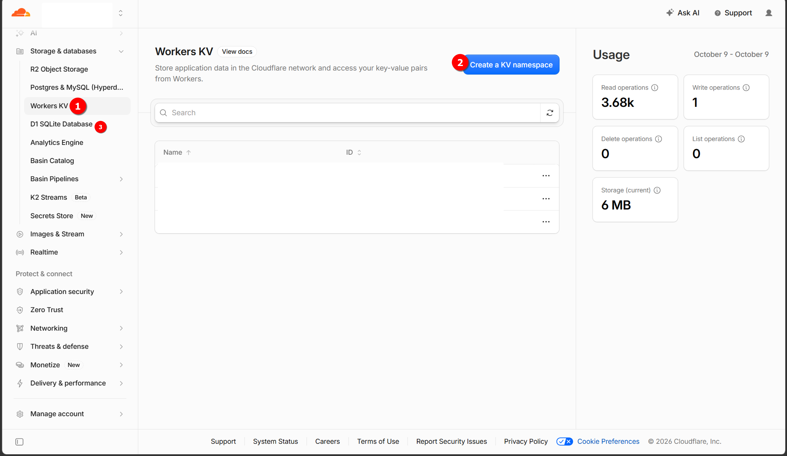
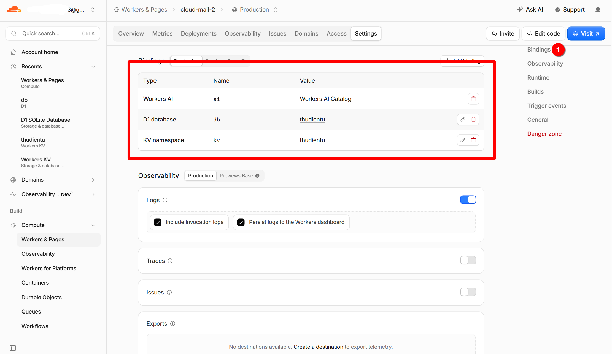
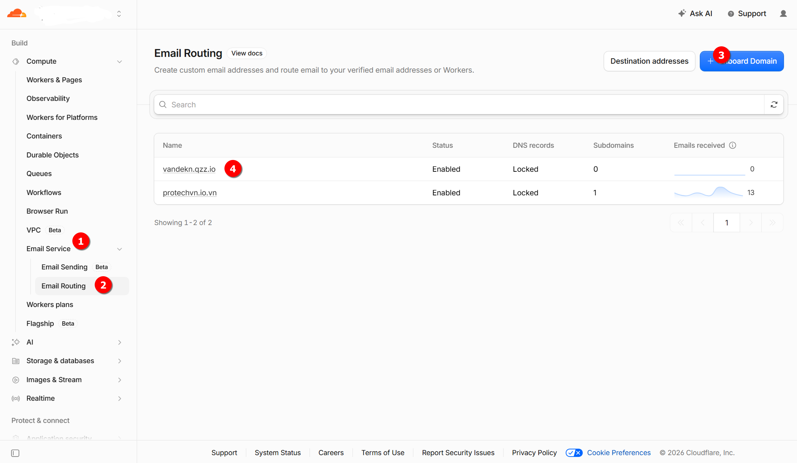
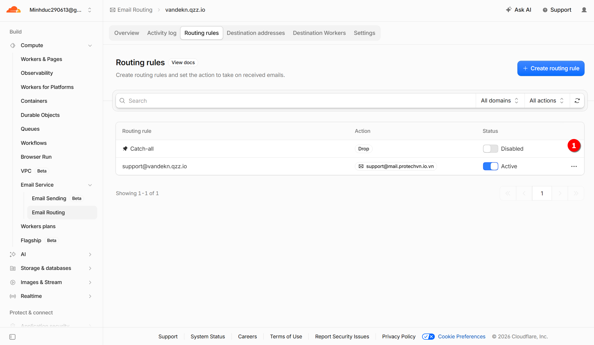
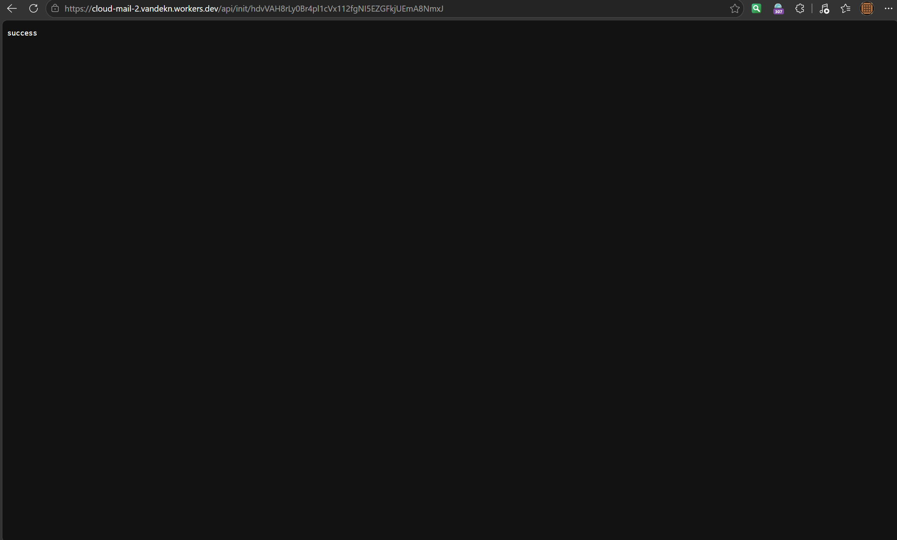
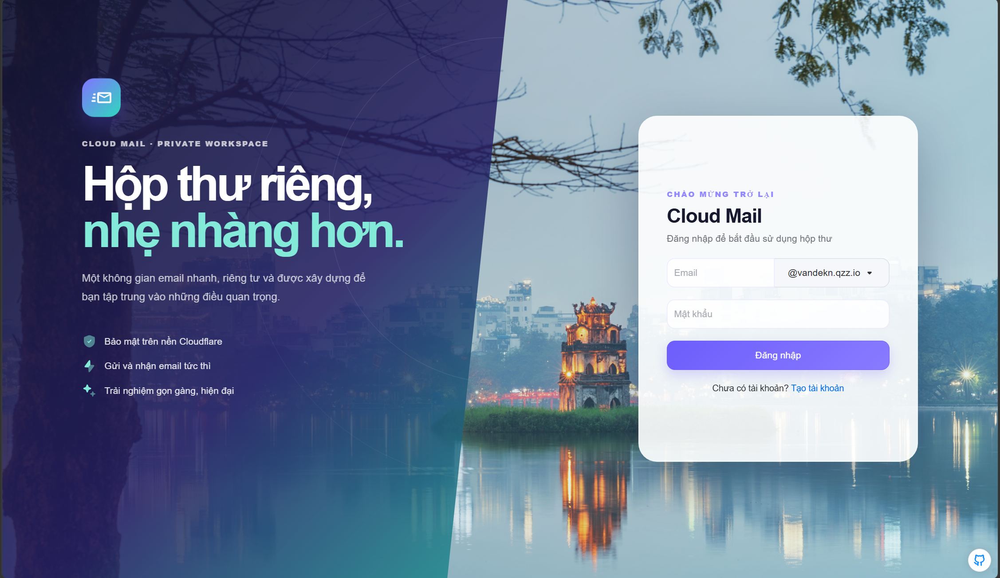

# Triển khai giao diện Dashboard

## Chuẩn bị tài khoản

[Đăng ký Cloudflare](https://dash.cloudflare.com/) và thêm tên miền của bạn.

Nếu chưa biết cách trỏ tên miền, bạn có thể xem hướng dẫn: [Trỏ tên miền về Cloudflare](https://cloud.tencent.cn/developer/article/2518586?from=15425&policyId=undefined&traceId=&frompage=seopage)

## Tạo dự án
1. Fork kho lưu trữ về tài khoản GitHub của bạn [https://github.com/maillab/cloud-mail](https://github.com/maillab/cloud-mail)

2. Tạo dự án Worker trên Cloudflare

3. Chọn Import từ GitHub

4. Thiết lập thư mục gốc là `mail-worker` và tiến hành triển khai

## Cấu hình biến môi trường

| Tên biến | Bắt buộc | Mục đích sử dụng |
|---|:---:|---|
| domain | ✅ | Tên miền email, nhiều tên miền dùng mảng JSON (ví dụ `["example.com","example2.com"]`) |
| admin | ✅ | Địa chỉ email quản trị viên (ví dụ `admin@example.com`) |
| jwt_secret | ✅ | Chuỗi bí mật JWT, nhập một chuỗi ngẫu nhiên không chứa ký tự đặc biệt |

1. Cài đặt tên miền tùy chỉnh (Custom Domain) và thêm các biến môi trường

## Liên kết cơ sở dữ liệu
1. Tạo cơ sở dữ liệu KV và D1

2. Thêm binding, tên biến binding bắt buộc phải là `kv` và `db`

## Cài đặt chuyển tiếp email

## Đăng nhập trang web
1. Mở trình duyệt và truy cập `https://<ten-mien-worker-cua-ban>/api/init/<jwt_secret_cua_ban>` để khởi tạo cơ sở dữ liệu

2. Mở trình duyệt truy cập tên miền tùy chỉnh, đăng ký tài khoản quản trị viên và đăng nhập vào trang web
